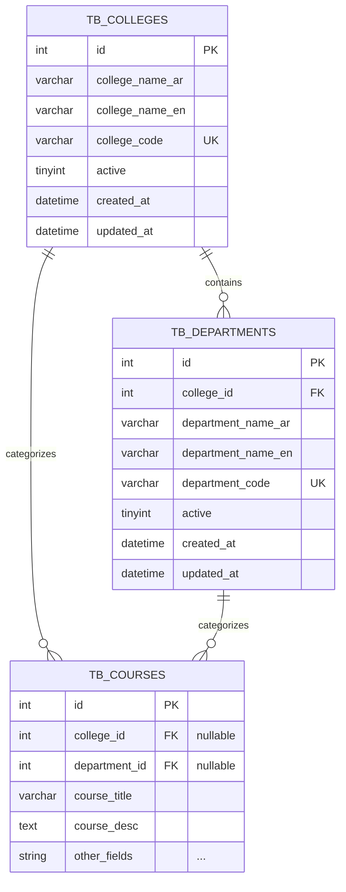

# Design Document: SEU College-Department Support

## Overview

This design implements organizational hierarchy support for Saudi Electronic University (SEU) by introducing two new database tables (colleges and departments) and enhancing the existing courses table with foreign key relationships. The implementation follows CodeIgniter 4 migration patterns and ensures proper data integrity through foreign key constraints and validation rules.

The feature enables the course management system to properly categorize and organize academic content according to SEU's actual organizational structure, supporting both Arabic and English names with proper UTF-8 encoding.

### Key Design Decisions

1. **Migration-Based Approach**: Using CodeIgniter 4's migration system ensures version control and rollback capability for database schema changes.

2. **Nullable Foreign Keys on Courses**: The `college_id` and `department_id` columns on `tb_courses` are nullable to allow gradual migration of existing course data and to support courses that may not yet be assigned to organizational units.

3. **RESTRICT on Delete**: Using `RESTRICT` for foreign key deletes on the courses table prevents accidental deletion of colleges/departments that have associated courses, preserving data integrity.

4. **Active Status Pattern**: Using an `active` flag instead of hard deletes allows historical data preservation while controlling which records appear in selection interfaces.

5. **UTF-8mb4 Encoding**: Using `utf8mb4` with `utf8mb4_unicode_ci` collation ensures proper storage and sorting of Arabic text and supports all Unicode characters including emojis.

## Architecture

### Database Schema Architecture



### Migration Execution Order

The migration follows strict dependency ordering:

1. **UP Migration Order**:
   - Create `tb_colleges` table (no dependencies)
   - Insert college seed data
   - Create `tb_departments` table (depends on colleges)
   - Insert department seed data
   - Add columns to `tb_courses` table (depends on colleges and departments)

2. **DOWN Migration Order** (reverse):
   - Drop columns from `tb_courses` table
   - Drop `tb_departments` table
   - Drop `tb_colleges` table

## Components and Interfaces

### Migration Component

**File**: `app/Database/Migrations/2026-07-28-130000_AddCollegeDepartmentSupport.php`

**Class**: `AddCollegeDepartmentSupport extends CodeIgniter\Database\Migration`

#### Public Methods

```php
public function up(): void
```
- Creates tables in dependency order
- Populates seed data
- Adds foreign key constraints
- Creates necessary indexes

```php
public function down(): void
```
- Removes schema changes in reverse order
- Drops foreign keys before dropping tables

#### Private Helper Methods

```php
private function createCollegesTable(): void
```
- Defines college table structure
- Sets up primary key and unique constraints
- Configures charset and collation

```php
private function insertCollegeData(): void
```
- Inserts SEU college records
- Uses consistent code format (COL001, COL002, etc.)

```php
private function createDepartmentsTable(): void
```
- Defines department table structure
- Creates foreign key to colleges table
- Sets up indexes

```php
private function insertDepartmentData(): void
```
- Inserts SEU department records mapped to colleges
- Uses consistent code format (DEPT001, DEPT002, etc.)

```php
private function addCoursesTableColumns(): void
```
- Adds college_id and department_id columns to tb_courses
- Creates foreign keys with RESTRICT on delete
- Adds indexes for query performance

### Validation Component

Although not implemented in the migration itself, application-level validation will be required to enforce business rules.

**Interface**: Course validation in models/controllers

#### Validation Rules

1. **Department-College Consistency**: When a course has a `department_id`, verify that the department's `college_id` matches the course's `college_id`.

2. **Null Constraint**: If `department_id` is set, `college_id` must also be set (cannot have department without college).

3. **Active Status Filtering**: When displaying colleges/departments for selection, filter to `active = 1`.

## Data Models

### College Entity

```php
// Logical representation
class College {
    public int $id;
    public string $college_name_ar;      // Required, e.g., "كلية الحوسبة والمعلوماتية"
    public ?string $college_name_en;     // Optional, e.g., "College of Computing and Informatics"
    public string $college_code;          // Required, unique, e.g., "COL001"
    public int $active;                   // Default: 1
    public ?DateTime $created_at;
    public ?DateTime $updated_at;
}
```

**Table**: `tb_colleges`

**Constraints**:
- `id`: Primary key, auto-increment
- `college_code`: Unique index
- Character set: `utf8mb4`, Collation: `utf8mb4_unicode_ci`

### Department Entity

```php
// Logical representation
class Department {
    public int $id;
    public int $college_id;                  // Foreign key to tb_colleges.id
    public string $department_name_ar;       // Required, e.g., "قسم علوم الحاسب"
    public ?string $department_name_en;      // Optional, e.g., "Computer Science Department"
    public string $department_code;          // Required, unique, e.g., "DEPT001"
    public int $active;                      // Default: 1
    public ?DateTime $created_at;
    public ?DateTime $updated_at;
}
```

**Table**: `tb_departments`

**Constraints**:
- `id`: Primary key, auto-increment
- `college_id`: Foreign key to `tb_colleges.id` (CASCADE on update/delete)
- `department_code`: Unique index
- Index on `college_id` for join performance
- Character set: `utf8mb4`, Collation: `utf8mb4_unicode_ci`

### Course Entity Enhancement

```php
// Enhancement to existing Course entity
class Course {
    // ... existing fields ...
    public ?int $college_id;      // Foreign key to tb_colleges.id (nullable)
    public ?int $department_id;   // Foreign key to tb_departments.id (nullable)
}
```

**Table**: `tb_courses` (enhanced)

**New Columns**:
- `college_id`: INT(11), nullable, foreign key to `tb_colleges.id` (RESTRICT on delete, CASCADE on update)
- `department_id`: INT(11), nullable, foreign key to `tb_departments.id` (RESTRICT on delete, CASCADE on update)

**New Indexes**:
- Index on `college_id`
- Index on `department_id`

### Foreign Key Relationships

#### tb_departments.college_id → tb_colleges.id
- **ON DELETE**: `CASCADE` - When a college is deleted, all its departments are also deleted
- **ON UPDATE**: `CASCADE` - When a college ID changes, department references update automatically

#### tb_courses.college_id → tb_colleges.id
- **ON DELETE**: `RESTRICT` - Prevents deletion of colleges that have associated courses
- **ON UPDATE**: `CASCADE` - When a college ID changes, course references update automatically

#### tb_courses.department_id → tb_departments.id
- **ON DELETE**: `RESTRICT` - Prevents deletion of departments that have associated courses
- **ON UPDATE**: `CASCADE` - When a department ID changes, course references update automatically

### Seed Data Structure

#### Colleges (Minimum 4 SEU Colleges)

```php
$colleges = [
    [
        'college_name_ar' => 'كلية الحوسبة والمعلوماتية',
        'college_name_en' => 'College of Computing and Informatics',
        'college_code' => 'COL001',
        'active' => 1
    ],
    [
        'college_name_ar' => 'كلية العلوم الإدارية والمالية',
        'college_name_en' => 'College of Administrative and Financial Sciences',
        'college_code' => 'COL002',
        'active' => 1
    ],
    [
        'college_name_ar' => 'كلية الصحة والحياة',
        'college_name_en' => 'College of Health and Life Sciences',
        'college_code' => 'COL003',
        'active' => 1
    ],
    [
        'college_name_ar' => 'كلية العلوم الأساسية والنظرية',
        'college_name_en' => 'College of Basic and Theoretical Sciences',
        'college_code' => 'COL004',
        'active' => 1
    ]
];
```

#### Departments (Minimum 12, including Computing departments)

```php
$departments = [
    // College of Computing and Informatics (COL001)
    [
        'college_id' => 1,  // Reference to كلية الحوسبة والمعلوماتية
        'department_name_ar' => 'قسم علوم الحاسب',
        'department_name_en' => 'Computer Science Department',
        'department_code' => 'DEPT001',
        'active' => 1
    ],
    [
        'college_id' => 1,
        'department_name_ar' => 'قسم تقنية المعلومات',
        'department_name_en' => 'Information Technology Department',
        'department_code' => 'DEPT002',
        'active' => 1
    ],
    [
        'college_id' => 1,
        'department_name_ar' => 'قسم أمن المعلومات',
        'department_name_en' => 'Information Security Department',
        'department_code' => 'DEPT003',
        'active' => 1
    ],
    [
        'college_id' => 1,
        'department_name_ar' => 'قسم علوم البيانات والذكاء الاصطناعي',
        'department_name_en' => 'Data Science and Artificial Intelligence Department',
        'department_code' => 'DEPT004',
        'active' => 1
    ],
    // College of Administrative and Financial Sciences (COL002)
    [
        'college_id' => 2,
        'department_name_ar' => 'قسم إدارة الأعمال',
        'department_name_en' => 'Business Administration Department',
        'department_code' => 'DEPT005',
        'active' => 1
    ],
    [
        'college_id' => 2,
        'department_name_ar' => 'قسم المحاسبة',
        'department_name_en' => 'Accounting Department',
        'department_code' => 'DEPT006',
        'active' => 1
    ],
    [
        'college_id' => 2,
        'department_name_ar' => 'قسم المالية',
        'department_name_en' => 'Finance Department',
        'department_code' => 'DEPT007',
        'active' => 1
    ],
    [
        'college_id' => 2,
        'department_name_ar' => 'قسم التجارة الإلكترونية',
        'department_name_en' => 'E-Commerce Department',
        'department_code' => 'DEPT008',
        'active' => 1
    ],
    // College of Health and Life Sciences (COL003)
    [
        'college_id' => 3,
        'department_name_ar' => 'قسم الصحة العامة',
        'department_name_en' => 'Public Health Department',
        'department_code' => 'DEPT009',
        'active' => 1
    ],
    [
        'college_id' => 3,
        'department_name_ar' => 'قسم المعلوماتية الصحية',
        'department_name_en' => 'Health Informatics Department',
        'department_code' => 'DEPT010',
        'active' => 1
    ],
    // College of Basic and Theoretical Sciences (COL004)
    [
        'college_id' => 4,
        'department_name_ar' => 'قسم الرياضيات',
        'department_name_en' => 'Mathematics Department',
        'department_code' => 'DEPT011',
        'active' => 1
    ],
    [
        'college_id' => 4,
        'department_name_ar' => 'قسم اللغة الإنجليزية',
        'department_name_en' => 'English Language Department',
        'department_code' => 'DEPT012',
        'active' => 1
    ]
];
```

## Error Handling

### Migration Execution Errors

1. **Table Already Exists**:
   - Check if tables exist before creating them
   - Use `$this->db->tableExists('tb_colleges')` and `$this->db->tableExists('tb_departments')`
   - Skip creation if exists (idempotent behavior)

2. **Foreign Key Constraint Failures**:
   - Ensure colleges table is created and populated before creating departments
   - Ensure both colleges and departments exist before adding foreign keys to courses
   - If foreign key creation fails, rollback transaction

3. **Column Already Exists**:
   - Check if columns exist before adding them using `$this->db->fieldExists('college_id', 'tb_courses')`
   - Skip if already exists

4. **Data Insertion Failures**:
   - Wrap insertions in try-catch blocks
   - Log errors for debugging
   - Use batch inserts for efficiency

### Application-Level Validation Errors

1. **Invalid Department-College Relationship**:
   ```php
   // Error: Department belongs to different college
   if ($course->department_id && $course->college_id) {
       $department = $departmentModel->find($course->department_id);
       if ($department->college_id !== $course->college_id) {
           throw new ValidationException('Department does not belong to the specified college');
       }
   }
   ```

2. **Department Without College**:
   ```php
   // Error: Department specified but no college
   if ($course->department_id && !$course->college_id) {
       throw new ValidationException('Cannot assign department without specifying college');
   }
   ```

3. **Inactive College/Department Selection**:
   ```php
   // Error: Attempting to assign inactive organizational unit
   if ($college && $college->active == 0) {
       throw new ValidationException('Cannot assign courses to inactive college');
   }
   ```

## Testing Strategy

This feature involves Infrastructure as Code (database migrations) and does not require property-based testing. The testing strategy focuses on:

### 1. Migration Testing

**Unit Tests for Migration**:
- Test successful execution of `up()` method
- Test successful rollback with `down()` method
- Verify table structures match specifications
- Verify indexes are created correctly
- Verify foreign keys are established with correct ON DELETE/UPDATE actions

**Example Test Cases**:
```php
public function testMigrationCreatesCollegesTable()
{
    $this->migration->up();
    $this->assertTrue($this->db->tableExists('tb_colleges'));
    
    // Verify structure
    $fields = $this->db->getFieldData('tb_colleges');
    $this->assertContains('college_name_ar', array_column($fields, 'name'));
    $this->assertContains('college_code', array_column($fields, 'name'));
}

public function testCollegesSeedDataInserted()
{
    $this->migration->up();
    $count = $this->db->table('tb_colleges')->countAllResults();
    $this->assertGreaterThanOrEqual(4, $count);
}

public function testForeignKeyConstraintsExist()
{
    $this->migration->up();
    
    // Verify foreign keys on tb_departments
    $fks = $this->db->getForeignKeyData('tb_departments');
    $this->assertCount(1, $fks);
    $this->assertEquals('tb_colleges', $fks[0]->foreign_table_name);
    
    // Verify foreign keys on tb_courses
    $fks = $this->db->getForeignKeyData('tb_courses');
    $collegeFK = array_filter($fks, fn($fk) => $fk->column_name === 'college_id');
    $this->assertNotEmpty($collegeFK);
}
```

### 2. Integration Testing

**Database Constraint Tests**:
- Attempt to delete a college with associated courses (should fail with RESTRICT)
- Attempt to delete a department with associated courses (should fail with RESTRICT)
- Delete a college with departments but no courses (should cascade to departments)
- Verify cascade updates work correctly

**Example Test Cases**:
```php
public function testCannotDeleteCollegeWithCourses()
{
    // Setup: Create college, department, and course
    $collegeId = $this->createCollege();
    $deptId = $this->createDepartment($collegeId);
    $courseId = $this->createCourse($collegeId, $deptId);
    
    // Attempt to delete college
    $this->expectException(DatabaseException::class);
    $this->db->table('tb_colleges')->delete($collegeId);
}

public function testDeletingCollegeCascadesToDepartments()
{
    $collegeId = $this->createCollege();
    $deptId = $this->createDepartment($collegeId);
    
    // No courses associated, so deletion should succeed
    $this->db->table('tb_colleges')->delete($collegeId);
    
    // Verify department was also deleted
    $dept = $this->db->table('tb_departments')->find($deptId);
    $this->assertNull($dept);
}
```

### 3. Validation Testing

**Application-Level Validation Tests**:
- Test department-college consistency validation
- Test null constraint validation (department without college)
- Test active status filtering

**Example Test Cases**:
```php
public function testRejectsInvalidDepartmentCollegeRelationship()
{
    $course = new Course();
    $course->college_id = 1;  // College of Computing
    $course->department_id = 5; // Business Admin (belongs to college 2)
    
    $this->expectException(ValidationException::class);
    $this->expectExceptionMessage('Department does not belong to the specified college');
    $this->courseModel->save($course);
}

public function testRejectsDepartmentWithoutCollege()
{
    $course = new Course();
    $course->department_id = 1;
    // college_id is null
    
    $this->expectException(ValidationException::class);
    $this->expectExceptionMessage('Cannot assign department without specifying college');
    $this->courseModel->save($course);
}
```

### 4. Character Encoding Tests

**UTF-8mb4 Verification**:
- Insert Arabic text and verify it's stored correctly
- Query and retrieve Arabic text
- Test sorting with Arabic characters
- Test special Unicode characters (emojis if applicable)

**Example Test Cases**:
```php
public function testArabicTextStoredCorrectly()
{
    $arabicName = 'كلية الحوسبة والمعلوماتية';
    $collegeId = $this->db->table('tb_colleges')->insert([
        'college_name_ar' => $arabicName,
        'college_code' => 'TEST001',
        'active' => 1
    ]);
    
    $college = $this->db->table('tb_colleges')->find($collegeId);
    $this->assertEquals($arabicName, $college->college_name_ar);
}
```

### 5. Smoke Tests

**Post-Deployment Verification**:
- Verify migration runs successfully in production environment
- Verify all tables exist with correct structure
- Verify seed data is present
- Verify foreign keys are active
- Verify charset is utf8mb4

**Checklist**:
- [ ] `tb_colleges` table exists
- [ ] `tb_departments` table exists
- [ ] `tb_courses` has `college_id` and `department_id` columns
- [ ] At least 4 colleges in database
- [ ] At least 12 departments in database
- [ ] Foreign keys are active and correct
- [ ] Indexes exist on foreign key columns
- [ ] Character encoding is utf8mb4 for all varchar/text columns

### 6. Manual Testing

**Admin Interface Testing** (if applicable):
- Test college selection dropdowns show only active colleges
- Test department selection filtered by selected college
- Test course assignment to college and department
- Test Arabic text displays correctly in UI

---

**Testing Summary**: This feature requires comprehensive migration testing, integration testing for database constraints, validation testing for business rules, and encoding tests for Arabic text support. Property-based testing is not applicable as this is Infrastructure as Code focused on database schema definition rather than algorithmic logic with varying inputs.
